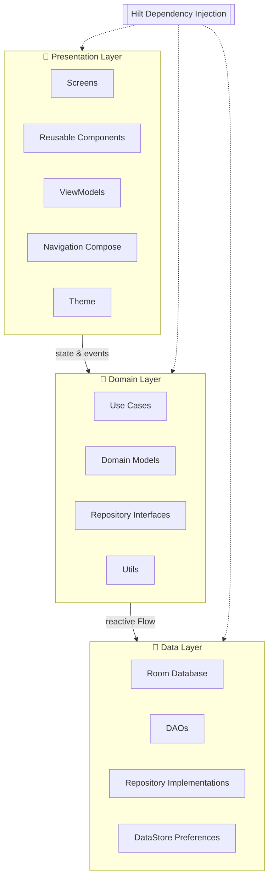
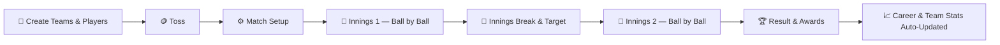

<div align="center">
<<<<<<< HEAD

</div>

# Run and deploy your AI Studio app

This contains everything you need to run your app locally.

View your app in AI Studio: https://ai.studio/apps/71adae47-e08e-44ea-b5cf-2bee6ee7ff5b

## Run Locally

**Prerequisites:**  [Android Studio](https://developer.android.com/studio)


1. Open Android Studio
2. Select **Open** and choose the directory containing this project
3. Allow Android Studio to fix any incompatibilities as it imports the project.
4. Create a file named `.env` in the project directory and set `GEMINI_API_KEY` in that file to your Gemini API key (see `.env.example` for an example)
5. Remove this line from the app's `build.gradle.kts` file: `signingConfig = signingConfigs.getByName("debugConfig")`
6. Run the app on an emulator or physical device
=======

<br/>

[](https://git.io/typing-svg)

<p><i>A premium, offline-first Android application for recording, managing, and analyzing local cricket matches — built to turn every gully game into a lasting cricket legacy.</i></p>


[](https://github.com/Prajwal-koundinya/CricBase-App/stargazers)
[](https://github.com/Prajwal-koundinya/CricBase-App/fork)
[](https://github.com/Prajwal-koundinya/CricBase-App/issues)
[](https://github.com/Prajwal-koundinya/CricBase-App/commits/main)


</div>

---

## 📑 Table of Contents

- [About](#-about)
- [How It Works](#-how-it-works)
- [Architecture at a Glance](#-architecture-at-a-glance)
- [Key Features](#-key-features)
- [Tech Stack](#-tech-stack)
- [Project Structure](#-project-structure)
- [Match Lifecycle](#-match-lifecycle)
- [Offline First](#-offline-first)
- [Built For](#-built-for)
- [Design Philosophy](#-design-philosophy)
- [Screenshots](#-screenshots)
- [Getting Started](#-getting-started)
- [Gradle Scripts](#-gradle-scripts)
- [Roadmap](#-roadmap)
- [Contributing](#-contributing)
- [Author](#-author)
- [License](#-license)
- [Support & Issues](#-support--issues)

---

## 📖 About

**Legacy XI** (this repository, `CricBase-App`) is a premium **offline-first cricket scoring application** built specifically for local cricket — street cricket, box cricket, turf cricket, society matches, and college tournaments.

Unlike a typical scorekeeping app, Legacy XI doesn't just record a match — it builds a **permanent cricket legacy**. Every completed match automatically rolls up into player careers, team histories, records, and achievements, so a match is never just a forgotten scoresheet — it's a chapter in someone's cricketing story.

The app is designed around one rule above all others: **the next ball is seconds away**. Every scoring interaction is optimized for a single hand, bright sunlight, and zero patience for typing.

---

## 🔬 How It Works

1. **🪙 Set Up** — Pick two teams, run the toss, and choose openers in a few taps.
2. **🏏 Score** — Record every ball with a one-tap grid: runs, extras, and wickets.
3. **⚙️ Auto-Compute** — Strike rotation, run rate, projected score, and bowler figures update instantly, with zero manual math.
4. **🏆 Celebrate** — At the end of the match, awards, confetti, and a full scorecard are generated automatically.
5. **📈 Relive** — Every player's career, every team's record, and every over ever bowled stays queryable, forever, fully offline.

---

## 🧩 Architecture at a Glance



Clean Architecture keeps every layer independently testable: `domain` never imports Android framework code, `data` owns the single source of truth (Room), and `presentation` only ever reacts to state — never mutates it directly.

---

## ✨ Key Features

### 🏏 Ball-by-Ball Scoring
- One-tap scoring for runs, extras, and wickets
- Automatic strike rotation
- Unlimited Undo / Redo
- Guided wicket flow (how out → fielder → next batter)
- End-of-over workflow with automatic bowler eligibility rules
- Innings transition with live target & required run rate
- Full match-completion flow with confetti and awards

### 👥 Player Management
- Reusable player profiles across every team and match
- Beautiful **color-based avatars** — no photos, no camera permissions, instantly recognizable
- Captain and Wicket-Keeper tagging, per team
- Full career tracking: matches, runs, wickets, catches
- Batting, bowling, and fielding statistics, computed automatically

### 🛡️ Team Management
- Create unlimited reusable teams (Team Sheets)
- Share a single player across multiple teams — no duplication
- Team-level win/loss records and history
- Team statistics that update after every match

### 📊 Advanced Match Analytics
| Analytics | Description |
|---|---|
| Worm Graph | Cumulative run progression, both innings overlaid |
| Run Rate Graph | Over-by-over scoring rate comparison |
| Partnership Analysis | Every partnership, visualized proportionally |
| Over-by-Over Summary | Expandable ball-by-ball history per over |
| Complete Scorecards | Full batting & bowling tables, extras, fall of wickets |
| Match Timeline | Key moments across the innings |
| Awards & Achievements | Auto-generated Player of the Match and more |

### 🏆 Career Statistics — Zero Manual Updates
Every completed match automatically updates:

`Matches Played` · `Runs` · `Batting Average` · `Strike Rate` · `Highest Score` · `Wickets` · `Bowling Economy` · `Best Bowling Figures` · `Catches` · `Wins` · `Awards`

### 📈 Player Leaderboards
Sort the whole squad by Most Runs, Highest Average, Highest Strike Rate, Most Wickets, Best Economy, Most Catches, Most Wins, Matches Played, or Awards Won.

### 🧠 Team-wise Player Analytics — a Legacy XI signature feature
Every player's performance is tracked **separately for every team they've represented**, not just as one blended career number:

| Scope | Matches | Runs | Average |
|---|---|---|---|
| **Career (all teams)** | 52 | 1827 | 44.8 |
| ↳ Royal Tigers | 18 | 724 | 48.2 |
| ↳ Phoenix XI | 16 | 618 | 41.3 |

This lets a player honestly see which team, format, or season they actually performed best in — something a single career average can never show.

### 🎨 Premium UI/UX
Material Design 3 · Jetpack Compose · Dark theme tuned for outdoor sunlight legibility · Smooth, purposeful animation · One-handed operation · Large touch targets · Minimal cognitive load — beautiful, but never in the way of the next ball.

---

## 🚀 Tech Stack

| Technology | Badge | Purpose |
|---|---|---|
| **Kotlin** |  | Primary application language |
| **Jetpack Compose** |  | Declarative UI toolkit |
| **Material Design 3** |  | Design system & theming |
| **Hilt** |  | Dependency injection |
| **Room** |  | Offline-first local persistence |
| **DataStore** |  | Lightweight key-value settings |
| **Coroutines / Flow** |  | Asynchronous, reactive data streams |
| **Navigation Compose** |  | In-app screen navigation |
| **Coil** |  | Lightweight image loading |
| **Custom Compose Charts** |  | Worm graphs, run-rate graphs, partnerships |
| **JUnit / Espresso** |  | Unit and instrumentation testing |
| **Git & GitHub** |  | Version control |

**Architecture:** Clean Architecture · MVVM · Repository Pattern · Unidirectional Data Flow

---

## 📂 Project Structure

```
CricBase-App/
├── app/
│   ├── presentation/
│   │   ├── screens/          # Composable full screens (Home, Live Scoring, Scorecard...)
│   │   ├── components/       # Reusable UI building blocks (avatars, stat chips, ball pills)
│   │   ├── navigation/       # Navigation Compose graph & routes
│   │   ├── theme/            # Color tokens, typography, motion spec
│   │   └── viewmodels/       # One ViewModel per screen, StateFlow-driven
│   │
│   ├── domain/
│   │   ├── models/           # Pure Kotlin domain models
│   │   ├── repository/       # Repository interfaces (no Android deps)
│   │   ├── usecases/         # RecordBall, UndoLastBall, ComputeAwards, etc.
│   │   └── utils/            # Strike-rotation rules, run-rate math, formatters
│   │
│   ├── data/
│   │   ├── database/         # Room database setup & migrations
│   │   ├── dao/               # DAOs for Player, Team, Match, Ball, Award
│   │   ├── entities/          # Room entities
│   │   ├── repository/        # Repository implementations
│   │   └── datastore/         # DataStore-backed app preferences
│   │
│   ├── di/                    # Hilt modules
│   └── utils/                 # Shared cross-cutting utilities
│
├── tests/                     # Unit + instrumentation tests
├── LICENSE
└── README.md
```

---

## 🔄 Match Lifecycle



Every arrow above is backed by a Room transaction — a ball is written to disk the instant it's confirmed, so the match can survive a crash, a force-close, or a dead battery without losing a single delivery.

---

## 💾 Offline First

Legacy XI is designed to work **entirely offline**, permanently — not just as a fallback mode.

- Local Room database as the single source of truth
- Automatic ball-by-ball saving — nothing is buffered or batched
- Resume any interrupted match exactly where you left off
- Persistent player careers and team history, forever local
- Instant loading, no network round-trip on any core screen
- No internet required, ever

No account creation. No cloud dependency. No advertisements. **Just cricket.**

---

## 📱 Built For

🏏 Street Cricket · 🏏 Box Cricket · 🏏 Turf Cricket · 🏏 College Cricket · 🏏 Society Matches · 🏏 Practice Matches · 🏏 Friendly Matches

---

## 🎯 Design Philosophy

- Speed before decoration.
- Every tap should matter.
- One-handed usability.
- Offline by default.
- Preserve every cricket memory.
- Beautiful, but never distracting.
- Automatic statistics — never manual data entry.
- Zero unnecessary complexity.

---

## 📸 Screenshots

> UI is under active development — real device screenshots will replace this section as screens are finalized. Once available, drop them into `app/assets/screenshots/` and reference them below.

<div align="center">


</div>

---

## 🚀 Getting Started

### 🔧 Prerequisites
- **Android Studio** — Koala (2024.1) or newer
- **JDK** — 17+
- **Kotlin** — 1.9+ (bundled with recent Android Studio)
- An Android device or emulator running **API 26 (Android 8.0)** or higher

### 📥 Installation

Clone the repository:
```bash
git clone https://github.com/Prajwal-koundinya/CricBase-App.git
cd CricBase-App
```

Open the project in **Android Studio**:
```
File → Open → select the CricBase-App folder
```

Let Gradle sync finish (Android Studio does this automatically on open), then run the app:
```
Run ▶ on any connected device or emulator
```

Or build and install straight from the command line:
```bash
./gradlew installDebug
```

---

## 🧩 Gradle Scripts

| Command | Description |
|---|---|
| `./gradlew assembleDebug` | Build a debug APK |
| `./gradlew assembleRelease` | Build a release APK |
| `./gradlew installDebug` | Install the debug build on a connected device |
| `./gradlew test` | Run unit tests (JUnit) |
| `./gradlew connectedAndroidTest` | Run instrumentation tests (Espresso, Compose UI tests) |
| `./gradlew lint` | Run Android Lint checks |
| `./gradlew clean` | Clean all build outputs |

---

## 🔮 Roadmap

### 🚧 Coming Soon
- [ ] Core match-scoring engine (ball-by-ball, undo/redo, wicket flow)
- [ ] Player & team career statistics engine
- [ ] Match scorecard and analytics screens
- [ ] UI polish pass across all screens
- [ ] Performance optimization for low-end devices

### 🎯 Long-term Vision
- [ ] Tournament management with points tables & Net Run Rate
- [ ] AI-generated match insights and highlights
- [ ] Player performance trend analysis over seasons
- [ ] Head-to-head team comparison tools
- [ ] Tablet-optimized layout
- [ ] Wear OS companion for live score glances
- [ ] Full match replay, ball by ball
- [ ] Exportable match reports (PDF / image)

---

## 🛠 Development Status

The application is currently under **active development**. Current focus areas:

`Core Match Engine` · `Statistics Engine` · `Player Analytics` · `UI Polish` · `Performance Optimization`

---

## 🤝 Contributing

Contributions, suggestions, and feature requests are always welcome.

1. **Fork** the repository
2. **Create** a feature branch (`git checkout -b feature/AmazingFeature`)
3. **Commit** your changes (`git commit -m 'Add: AmazingFeature'`)
4. **Push** to the branch (`git push origin feature/AmazingFeature`)
5. **Open** a Pull Request

### Development Guidelines
- Follow Kotlin coding conventions and idiomatic Compose patterns
- Keep `domain` free of Android framework imports
- Write unit tests for new use cases
- Match the existing dark-theme, sunlight-legible design language

---

## 👨‍💻 Author

**Prajwal Koundinya**
- 🌐 GitHub: [@Prajwal-koundinya](https://github.com/Prajwal-koundinya)
- 💼 LinkedIn: [Connect with me](https://www.linkedin.com/in/prajwal-kowndinya-7506b4268/)
- 📧 Email: prajwalkowndinya@gmail.com
- 🌟 Portfolio: [Portfolio Website](https://mellow-faloodeh-7f6f0f.netlify.app/)

---

## 📜 License

This project is licensed under the **MIT License** — see the [LICENSE](LICENSE) file for details.

---

## 📞 Support & Issues

1. 🐛 **Bug Reports** — [Open an Issue](https://github.com/Prajwal-koundinya/CricBase-App/issues)
2. 💡 **Feature Requests** — [Start a Discussion](https://github.com/Prajwal-koundinya/CricBase-App/discussions)
3. 📧 **Direct Contact** — prajwalkowndinya@gmail.com

---

<div align="center">

### ⭐ If you like this project, consider giving it a star!

*"Every match tells a story. Legacy XI makes sure it's never forgotten."* 🏏


</div>
>>>>>>> 165f926e1670050285736669bab9c859169fa46a
